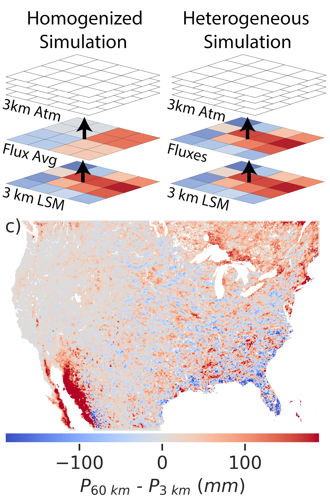
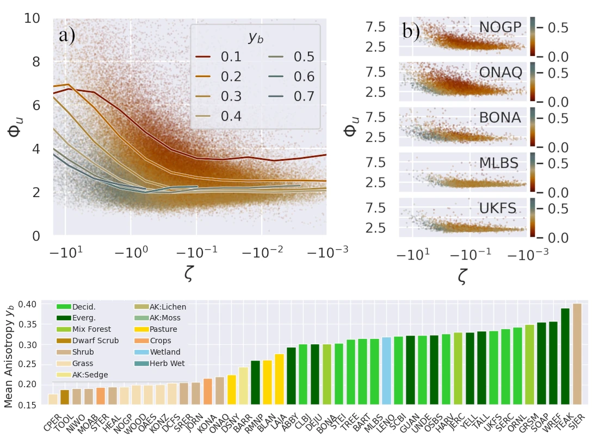
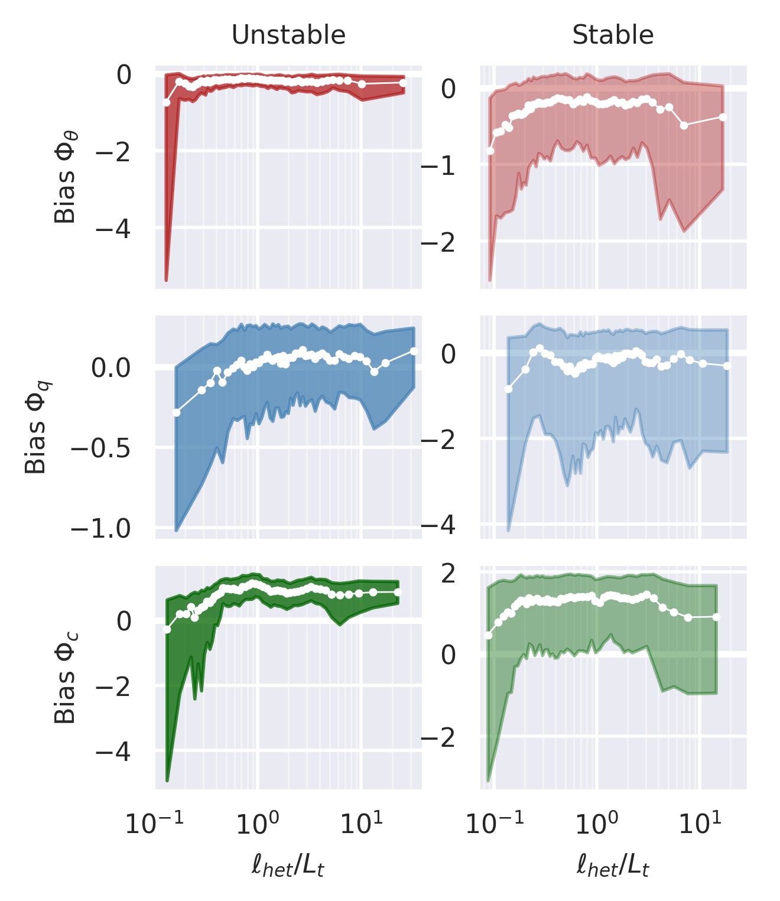

I am an atmospheric modeler, boundary layer meteorologist, computational hydrologist, engineer, teacher and mentor working to improve global understanding of the connection between the land surface we live on and the atmosphere above us. My research aims to build models for water, carbon and energy that apply in data rich uniform cropland, or poorly instrumented, vast mountain forests, allowing environmental scientists, modelers and decision makers in all parts of our earth to make informed decisions. To this end, I work collaboratively to harness a wealth of satellite and in-situ data, high resolution models, fundamental physics, and modern machine learning methods to improve predictions of how water, energy, and carbon moves across the land-atmosphere continuum, especially in complex terrain and heterogeneous landscapes.

My core research is outlined in the four categories below:

Modeling the Impact of Mesoscale Circulations
=====

When there is a hot dry patch of land, next to a cool wet patch, circulations can begin to form. The literature has shown that these circulations can impact cloud development and patterning. Modern Earth System Models (ESMs) operate at a much larger scale than than the kilometer scale surface heterogeneity needed to form these circulations. This work uses large-eddy simulation (LES) output to parameterize these circulations and their impacts on clouds.

> ### Key Results
> * CLUBB, a boundary layer scheme, is run as a single column model with two columns, one over the hot dry patch and another over the cold wet patch, for 92 one day simulations, with a modeled circulation connecting them
> * The two column model shows qualitative agreement with high resolution models, with increased cloud development when circulations are modeled, at a fraction of the compuational cost
> * Heterogeneity Driven Circulations can be measured with ground based lidar networks with magnitude of circulation correlated to surface heterogeneity

> ### Publications
> * [A Two-Column Model Parameterization for Subgrid Surface Heterogeneity Driven Circulations](https://tswater.github.io/publication/2022_a)
> * [Leveraging Remote Sensing Observations to Analyze the Effect of Land Surface Heterogeneity on Mesoscale Atmospheric Circulations](https://tswater.github.io/publication/2025_d)
> * Related Work:  [Assessing the Atmospheric Response to Subgrid Surface Heterogeneity in the Single-column Community Earth System Model, version 2 (CESM2).](https://doi.org/10.1029/2022MS003517 )

 

Continental Scale Impact of Surface Heterogeneity
=====

When ESMs and numerical weather prediction (NWP) schemes are run, they often operate with a higher resolution land surface model (LSM) which is then homogenized for exchange with the atmosphere. This "lost" heterogeneity can have atmospheric impacts locally and downstream. The impact this homogenization has, and how land surface heterogeneity is connected to atmospheric impact, is explored as part of this project.

> ### Key Results
> * Three summers of daily, 3km resolution WRF simulations across the continental United States (CONUS) with heterogeneous and homogenized surface fluxes show significant changes in precipitation statistic
> * Homogenization leads to increases in latent heat fluxes and rainfall, and a decrease in mesoscale turbulence in the boundary layer.
> * Most significant imapacts are observed in water limited regiemes where bodies of water, (small lakes, large rivers, coastal regions) are homogenized with drier land

> ### Publications 
> * [Surface Flux Homogenization and its Impacts on Convection Across CONUS](https://tswater.github.io/publication/2025_a)

 

Surface Layer Exchange and Turbulence Anisotropy
=====

In modern atmospheric models (NWP, ESMs, LES) Monin-Obukhov Similarity Theory (MOST) is applied to determine exchange of heat, energy, and moisture from the land surface to the atmosphere, despite significant errors. Recent work from [Stiperski et. al](https://doi.org/10.1103/PhysRevLett.130.124001) has shown the anisotropy of turbulence may account for observed deviations from MOST. This project seeks to bridge the gap between physics of surface layer turbulence, and the needs for application in modeling systems.

> ### Key Results
> * Relations developed by Stiperski have shown strong applicability over the vast and diverse [NEON eddy-covariance tower network](https://www.neonscience.org/field-sites) with little modification.
> * Models of surface exchange are improved by considering anisotropy in novel scaling for the scalar variances (heat, water vapor, carbon dioxide) and velocity variances
> * Anisotropy, and surface layer scaling, varies significantly by site characteristics 

> ### Publications 
> * [Evaluating Anisotropy-based Monin-Obukhov Similarity Theory over Canopies and Complex Terrain](https://tswater.github.io/publication/2025_b)
> * [Impact of Heterogeneity on Scalar Flux Variance Relations Across Diverse Ecosystems](https://tswater.github.io/publication/2025_c)
> * [Examining Parameterizations of Potential Temperature Variance Across Varied Landscapes for Use in Earth System Models](https://tswater.github.io/publication/2022_a)

 

Surface Heterogeneity and Biogeochemical Cycles
=====

Like many other earth system processes, the cycling of carbon, heat and water can be effected by the heterogeneity of the surface. This area of work seeks to leverage understanding of ecohydrology, boundary layer physics, and large environmental datasets, to examine how spatial patterns at the surface affect our models and measurements of carbon and moisture exchange between the biosphere, atmosphere and hydrosphere. 

> ### Key Results
> * For highly heterogeneous surfaces, traditional surface layer theory fails when turbulent lengthscales are large

> ### Publications
> * [Impact of Heterogeneity on Scalar Flux Variance Relations Across Diverse Ecosystems](https://tswater.github.io/publication/2025_c)
