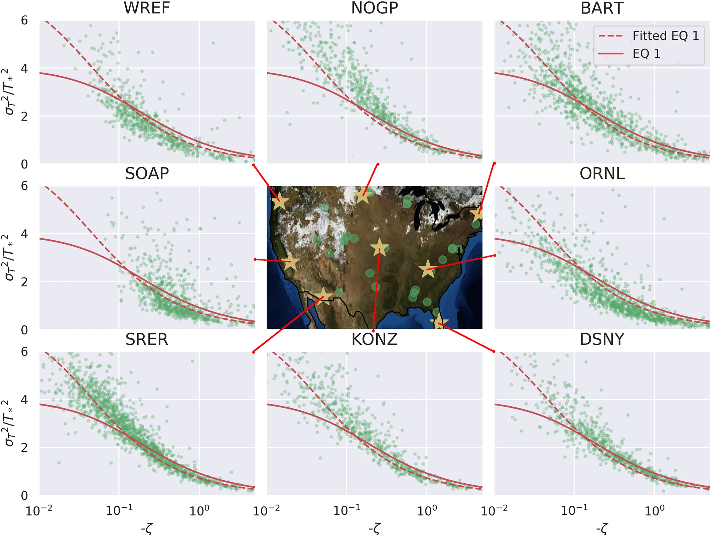
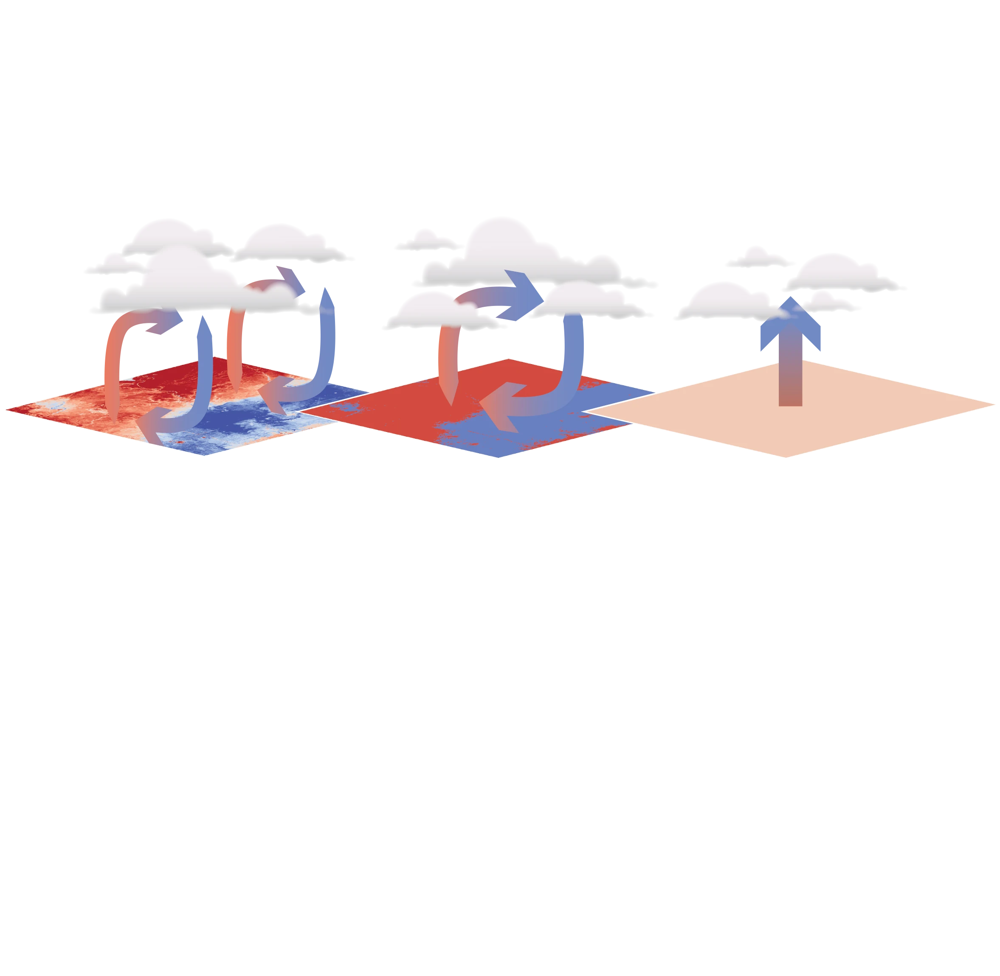

I am a computational hydrologist, atmospheric modeler, scientist, engineer, teacher and mentor working to improve global understanding of the connection between the land surface we live on and the atmosphere above us. My research aims to build models for water, carbon and energy that apply in data rich uniform cropland, or poorly instrumented vast mountain forests, allowing environmental scientists, modelers and decision makers in all parts of our earth to make informed decisions. To this end, I work to harness a wealth of satellite and in-situ data, high resolution models, fundamental physics, and modern machine learning methods to improve predictions of how water, energy, and carbon moves across the land-atmosphere continuum. 

Surface Boundary Conditions
=====

To model the lower atmosphere, we need accurate boundary conditions at the earth's surface. This work examines one of the surface boundary conditions of turbulence, potential temperature variance. The typical parameterizations used in modern atmospheric and Earth System Models are evaluated accross many varried terrain types, and constraints on model performance as well as proposed alterations to the existing parameterizations are evaluated.

### Key Results
* Models of potential temperature variance in the surface layer based on similarity theory were evaluated using data from 39 varied sites over 2.5 years
* Existing schemes perform well across most surfaces, although the data shows a significant bias in the values of the similarity constants
* Canopy structure and surface heterogeneity drive a large portion of inter-site variability in model performance

Boundary Layer Clouds and Secondary Circulations
=====

When there is a hot dry patch of land, next to a cool wet patch, circulations can begin to form. These circulations can begin to form when the scales of the patches are around 5 km or greater, and the literature has shown that these circulations can impact cloud development and patterning. Modern Earth System Models (ESMs) operate at a much larger scale than 5km. This work seeks to parameterize these circulations and their impacts on clouds without resorting to computationally intensive models.
### Key Results
* CLUBB, a boundary layer scheme, is run as a single column model with two columns, one over the hot dry patch and another over the cold wet patch, for 92 one day simulations, with a modeled circulation connecting them
* The two column model shows qualitative agreement with high resolution models, with increased cloud development when circulations are modeled, at a fraction of the compuational cost

