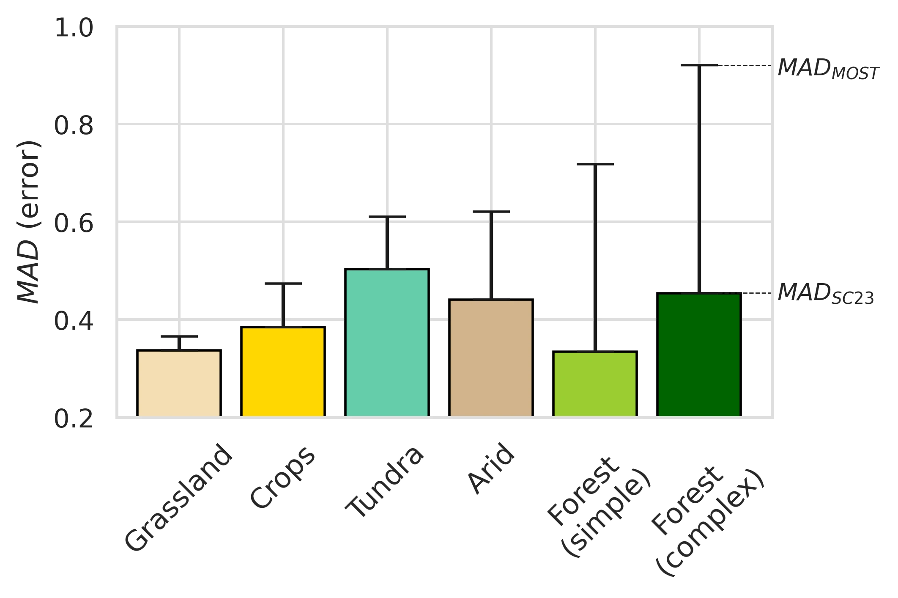
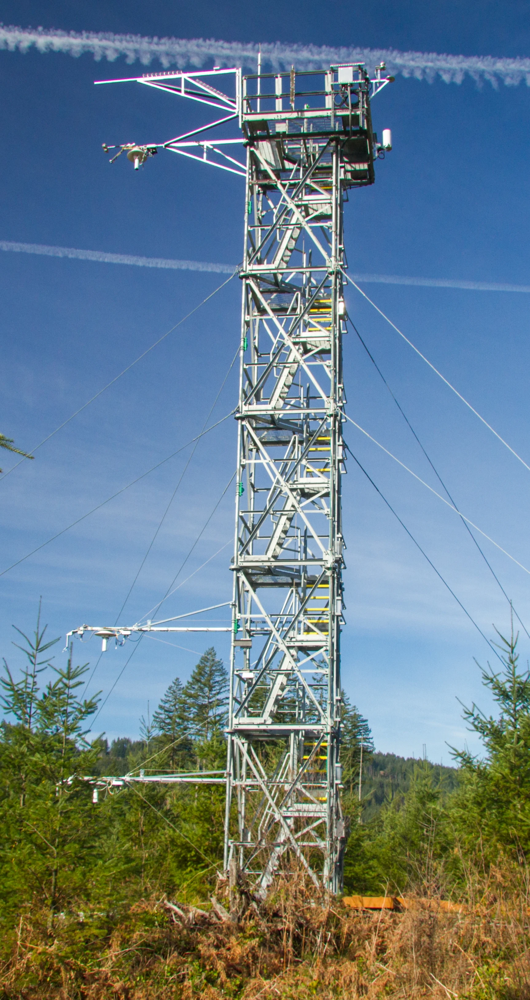
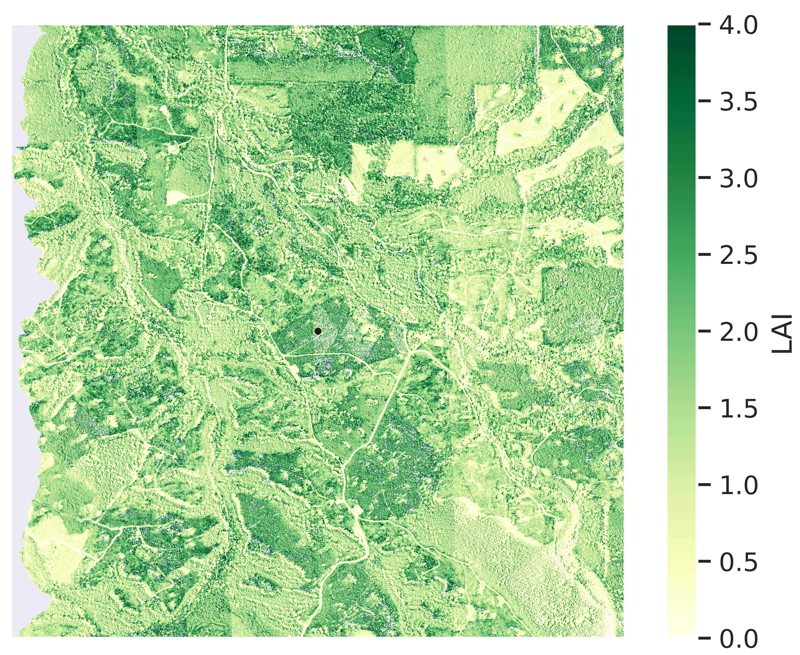
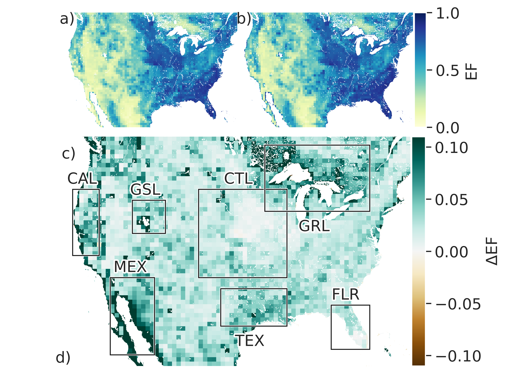
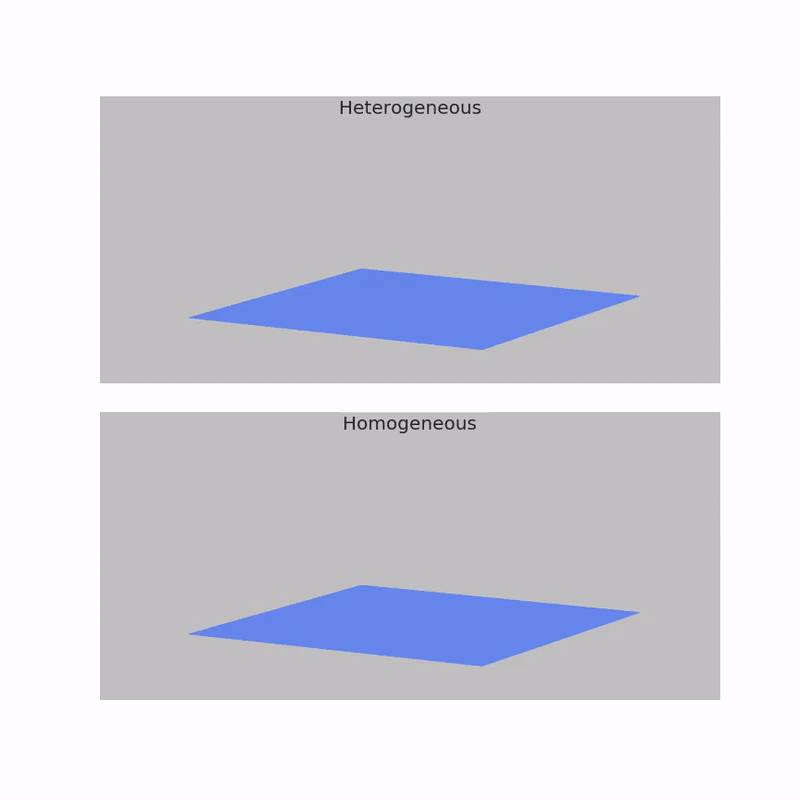

<!-- STYLING DONE, CONTENT BELOW -->
My research spans the fields of hydrology, atmospheric science, natural hazard prediction, weather, climate, geospatial analysis, and the physics of fluids. My research combines a drive for understanding the statistics of complex spatial patterns, a passion for the processes that drive interaction between the land and the atmosphere, and a penchant for connecting diverse environmental datasets to improvements in model representation of the Earth System and Natural Hazards. I am eager to engage with any students and researchers that are looking to use atmospheric modeling (LES, NWP, ESM, weather, climate and air pollution prediction models), meteorological tower data, and/or geospatial analysis to answer key environmental and engineering questions, especially when focused on the interaction between the land surface (topography, land-use, human development, vegetation, soil moisture) and the atmosphere. Within this broad group, my focus areas are:

  

     <h2>Turbulence and Exchange Between the Land and Atmosphere</h2>
     

        

            <!-- Teaser Text Here -->
             <b>Key Topics:</b> Turbulence, flux tower, evaporation, ecohydrology, carbon cycle, fluid dynamics  
            <b>Key Questions:</b> How can we understand, and better predict, the exchange of energy, water, carbon and pollutants between the land and atmosphere in complex ecosystems?
        

        

            <figure style="width:60%;float:left;">
                
                <figcaption>Comparison of error from traditional surface flux-variance exchange models (black lines) and modified models from SC23 and Waterman 2026 (colored bars) for sites in the National Ecological Observation Network</figcaption>
            </figure>
            
        

    

    <!-- More Text Here -->
    <b>Summary of Research:</b> The exchange of mass (water, carbon) and energy (heat, momentum) from the surface to the atmosphere sets limiting conditions for weather and climate models, controls pollutant concentrations and is vital in understanding ecohydrology. The parameterizations for surface exchange in nearly all Land Surface Models (LSMs) used in Earth System Models (ESMs) to analyze climate and weather came from turbulent flux tower analysis. Tower networks, however, have limited spatial coverage. This pillar is focused on combining satellite and in situ data to make tower data more useful, understanding more about the fundamentals of turbulent fluids, and improving parameterizations for weather, climate, and natural hazard prediction.
      <b>Some Project Areas and Broad Questions</b><ul>
    <li>How sensitive are weather, climate, and pollution spread modeling to how we represent surface exchange?</li>
    <li>Do idealized theories for surface exchange hold across different temporal scales?</li>
    <li>What are the key differences in behavior of water, carbon and energy exchange between different ecosystems? What controls and causes these differences?</li></ul>
    <b>Selected Publications</b><ul>
    <li><a href="/publication/waterman_impact_2026"> Waterman, T., Stiperski, I., Torres-Rojas, L., Calaf, M. (2026). Impact of heterogeneity on scalar flux variance relations across diverse ecosystems. Agricultural and Forest Meteorology, 384, 111167</a></li>
    <li><a href="/publication/waterman_evaluating_2026">Waterman, Tyler S., Stiperski, Ivana, Chaney, Nathaniel, Calaf, Marc (2026). Evaluating anisotropy-based Monin–Obukhov similarity theory over canopies and complex terrain. Quarterly Journal of the Royal Meteorological Society, e70206</a></li></ul>
  

  <button class="read-more-btn">Read more</button>

 

  

     <h2>The Land-Atmosphere Impact of Complex Spatial Patterns</h2>
     

        

            <!-- Teaser Text Here -->
             <b>Key Topics:</b> remote sensing, geospatial analysis, natural hazards, environmental data, land use change  
            <b>Key Questions:</b> What impact do complex patterns of the land surface have on natural hazards (urban heat island, flooding, pollution spread) and the atmosphere and how do humans, engineers, and urban planners influence these patterns? Can we better quantify the key scales for impact?
        

        

            <figure style="width:40%;float:left;">
                
                <figcaption>1 meter resolution map of leaf area index (vegetation) over a site in Washington state used to evaluate impacts of spatial patterns on carbon exchange</figcaption>
            </figure>
            <figure style="width:40%;float:right;">
                
                <figcaption>Change in temperature between a realistic configuration and an urban greening configuration during a heatwave in Dallas (Sarah Bailey, Undergraduate, Duke University)</figcaption>
            </figure>
        

    

    <!-- More Text Here -->
    <b>Summary of Research:</b> Topography, vegetation, soil and atmospheric properties vary spatially at scales ranging from centimeters to hundred of kilometers. Quantifying complex environmental spatial patterns in a way that is relevant for engineering, models and natural hazards can be challenging as human scales (irrigation, levees, fire breaks, urban sprawl, etc.) must be considered as well. Research in this pillar focuses on quantifying complex geometry in a way that is relevant for natural processes.
      <b>Some Project Areas and Broad Questions</b><ul>
    <li>Understanding how different patterns of urban greening, adding trees and other vegetation to urban areas, may reduce the impacts of heat waves.</li>
    <li>Do spatial patterns significantly affect our measurements for surface exchange? Can we quantify this?</li>
    <li>Can we better represent engineered systems (solar power, irrigation, urban development) in large scale models?</li>
    <li>What are key spatio-temporal characteristics of precipitation and natural hazards? What controls these spatio-temporal characteristics?</li></ul>
    <b>Selected Publications</b><ul>
    <li><a href="/publication/waterman_impact_2026">Waterman, T., Stiperski, I., Torres-Rojas, L., Calaf, M. (2026). Impact of heterogeneity on    scalar flux variance relations across diverse ecosystems. Agricultural and Forest Meteorology, 384, 111167</a></li>
    <li><a href="/publication/torresrojas_geostatisticsbased_2024">Torres‐Rojas, L., Waterman, T., Cai, J., Zorzetto, E., Wainwright, H. M., Chaney, N. W. (2024). A Geostatistics‐Based Tool to Characterize Spatio‐Temporal Patterns of Remotely Sensed Land Surface Temperature Fields Over the Contiguous United States. Journal of Geophysical Research: Atmospheres, 129, e2023JD040679</a></li></ul>
  

  <button class="read-more-btn">Read more</button>

 

  

     <h2>Multi-scale Prediction for Weather, Climate and Air Quality</h2>
     

        

            <!-- Teaser Text Here -->
             <b>Key Topics:</b> rainfall, exchange, circulations, clouds, pollution spread, improving prediction  
            <b>Key Questions:</b> How do we reconcile physics and data when our scale for predicting the environment does not match with the scales of key processes or the scales of  human/engineering/environmental impact?
        

        

            <figure style="width:40%;float:left;">
                
                <figcaption>Change in evaporative fraction, the portion of going into heat versus evaporation, between a simulation with and without flux averaging, a common simplification applied in large scale models. Results show this common averaging causes overestimates of evaporation (higher EF)</figcaption>
            </figure>
            
        

    

    <!-- More Text Here -->
    <b>Summary of Research:</b> Spatial heterogeneity, and how complex geometries affect processes, is challenging to understand in the natural world. In large scale Earth System Models additional challenges present themselves. In particular, many inputs and model components operate at different spatial scales and resolutions, creating challenges when they are connected. Specifically, many models have different grid resolutions for the land, ocean and atmospheric components as development and research into each has proceeded separately. The consequences need to be understood and addressed.
      <b>Some Project Areas and Broad Questions</b><ul>
    <li>What errors are caused in weather/climate prediction by the mismatch in scales between the land and atmosphere?</li>
    <li>Will higher resolution precipitation in models yield better prediction for localized drought, agriculture, and ecosystem modeling?</li>
    <li>Can we reliably predict the impact of heterogeneity driven circulations (i.e. sea breeze)?</li>
    <li>Can we use LiDAR to measure 3 dimensional flows in the atmosphere that, previously, have not been quantified directly?</li>
    <li>How do local flows and heterogeneity impact the initiation of convective thunderstorms?</li></ul>
    <b>Selected Publications</b><ul>
    <li><a href="/publication/waterman_surface_2025">Waterman, Tyler, Dirmeyer, Paul, Chaney, Nathaniel (2025). Surface Flux Homogenization and its Impacts on Convection Across CONUS. Journal of Hydrometeorology</a></li>
    <li><a href="/publication/waterman_twocolumn_2024">Waterman, T., Bragg, A. D., Hay‐Chapman, F., Dirmeyer, P. A., Fowler, M. D., Simon, J., Chaney, N. (2024). A Two‐Column Model Parameterization for Subgrid Surface Heterogeneity Driven Circulations. Journal of Advances in Modeling Earth Systems, 16, e2023MS003936</a></li>
    <li><a href="/publication/waterman_satellite_2026">Waterman, T., Germ, P., Calaf, M., Pardyjak, E., Chaney, N. (2026). A Satellite Remote Sensing and Doppler LiDAR-based Framework for Evaluating Mesoscale Flows Driven by Surface Heterogeneity. Preprint.</a></li></ul>
  

  <button class="read-more-btn">Read more</button>

