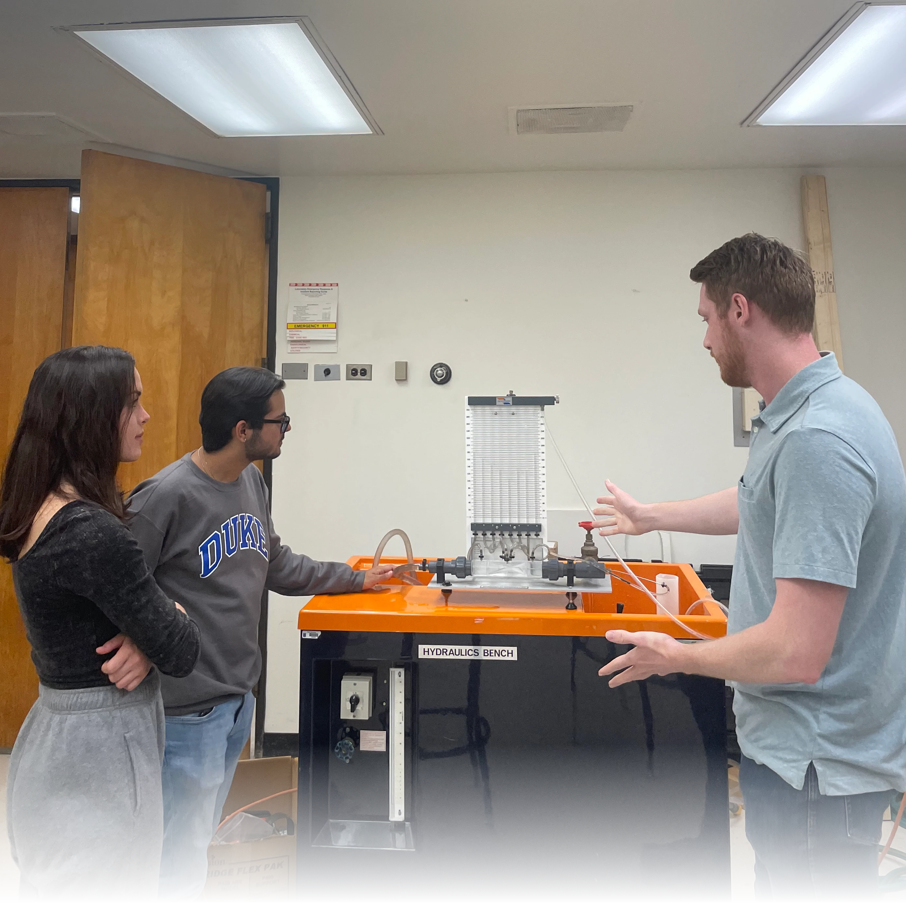

## Teaching Strategy
I was drawn to study the natural world, at least partially, due to the vast interconnectedness of the systems that cycle water, carbon, and energy on our planet. To conceptually grasp these natural cycles requires a solid base in chemistry, biology, geology, physics and ecology. To extend beyond understanding into modeling and analyzing these phenomena expands the field into engineering, geospatial statistics, and advanced computational methods. Bringing these wide ranging concepts together can be a challenge for students, but with proper scaffolding and guidance success is as straightforward as possible for learners of all types. To achieve this end, my overall goals as an instructor are to (1) provide tools and support for **students to make connections between complex ideas themselves** rather than through direct instruction, (2) have every slide, homework, and project **serve a well justified educational purpose focused on student learning** above evaluation and (3) to be **explicit, open, and transparent about the learning process** with students in the classes I teach. 

Instead of simply hearing a complex idea in a lecture, students who navigate through an instructor supported framework that encourages students to make key connections themselves or through discussions with peers will find greater success. **Student active learning provides a sense of accomplishment, a sense of responsibility for their own learning and makes it more likely they will retain the information.** Teaching methods including peer evaluation, peer instruction and group activities (see following section for details of past implementation) promote this mindset as a collective. Emphasizing well scaffolded projects, and homework assignments that emphasize synthesis and analysis over basic recollection of concepts promotes these ideas on a more individual level and provides for deeper learning experiences.

**Prioritizing purposeful education, and regularly reassessing my commitment to it through self reflection and student evaluations, is key to pedagogical success.** Students have a limited time in class, and an even more limited time during which they can fully focus on lecture material (citation). Taking advantage of the popular method of flipped classes can allow for the limited instructor to student contact time to be most productive and avoid long lectures that studies show students are not able to fully absorb. When it comes to assignments, the natural extension of this philosophy is to avoid viewing homework as a tool to evaluate student learning, but rather as an opportunity for students to expand their understanding. 

Students also deserve respect as key members of the educational process rather than simply subjects or clients of instruction. To maximize student buy-in to the educational process, especially in the case of modern pedagogical methods that may be unfamiliar to some students [citation], **it is important that students understand why their instructor is teaching things a certain way, why they are being asked to rise to a specific challenge and how this will help them learn.** This can ideally generate a few desirable results for students including promoting metacognition (thinking about one's own learning) and a greater willingness to engage with a given method or activity since its purpose and benefits are made clear.

## Applications of Teaching Strategy

My teaching experience began in 2018 when I took part in the UC Berkeley DeCal program where I developed the [curriculum](https://github.com/tswater/tswater.github.io/raw/master/files/Syllabus_CEE98.pdf) and teaching materials for Water Resources Development, a 2 unit undergraduate course. Students learned applications of water treatment and management with a heavy focus on applications to small scale systems found in low density communities that lack modern water resources infrastructure. I developed a variety of course materials, including homework assignments, in-class activity plans, final projects, guest lectures with collaborators and more traditional lecture material. The [homework assignments](https://github.com/tswater/tswater.github.io/raw/master/files/HW_CEE98.pdf) were designed to be open ended in nature, and called on students to make connections with the lecture material and their own knowledge, following my first goal above.

In teaching this course, I found success came more easily if I could regularly gauge their understanding of the material, through short questions or pair-share activities. I also found the greatest success with both the final project as well as a case study based group activity, both of which involved peer to peer teaching, sharing and engagement. 

The final project ([instructions](https://github.com/tswater/tswater.github.io/raw/master/files/FinalProjectInstructions.pdf)/[student work](https://github.com/tswater/tswater.github.io/raw/master/files/IWD_Final_Project.pdf)) was structured as each student independently developing a small guide intended for other future students of the class to gain a more in depth understanding of an aspect of the course material. The project also employed a peer review process to both improve the quality of work and give students the opportunity to help and teach each other. 

The group activity, based around a case study, put students into small groups where they were each given a few minutes to discuss potential solutions to a fictional community's water problems. Once each group had developed their solution, they shared it with the class. **This gave students the opportunity to discuss and synthesize course material together, and articulate and critique solutions themselves,** as I outlined in my first teaching goal. I found that the students were particularly engaged during this part of the course and learned this section's material well during the group activity and plan to apply this method in other courses going forward. 

In addition, I have served as a Teaching Assistant (TA) for the Duke University Civil and Environmental Engineering Department in the graduate level course Environmental Spatial Data Analysis (ESDA) as well as an undergraduate level course in fluid mechanics. My responsibilities for ESDA included lecturing for a four class period section of the course, as well as holding office hours, answering student questions, and assisting them on their final independent research projects that serves as the capstone of the course. Throughout the course, I worked with the professor to retool the [homework](https://github.com/tswater/tswater.github.io/raw/master/files/HW1_CEE690.pdf) sets, following the second goal above and articulated directly to students the purpose and practical use of the homework sets I helped design. Students found my teaching style effective, with all the students that completed the evaluation awarding a 5/5 in each category, with one saying that I “... was an integral part of [their] learning” (emphasis theirs).

## Development and Looking Ahead
Due to the interdisciplinary nature of my research focus, I am comfortable teaching a variety of subjects. I feel equipped to teach a number of methods based classes, including introductory geographical information systems (GIS), spatial data analysis and remote sensing, introductory python or matlab for engineers, and introductory computational methods. I would also eagerly tackle more conceptual courses, such as introductory environmental engineering, [hydrology](https://github.com/tswater/tswater.github.io/raw/master/files/HydroSyllabus.pdf), meteorology, fluid mechanics or environmental science as well as advanced courses in hydrology, hydrometeorology, micrometeorology and earth system modeling.

I am excited to continue to advance my teaching methods, guide new students and help them see the beautiful intricacies and complexities of the natural world. I strive to bring together my research, my own teaching experiences and developmental programs such as the Certificate in College Teaching and Preparing Future Faculty to polish my teaching techniques and support the next generation of scholars and engineers.

# Teaching Experiences -- Details




  

